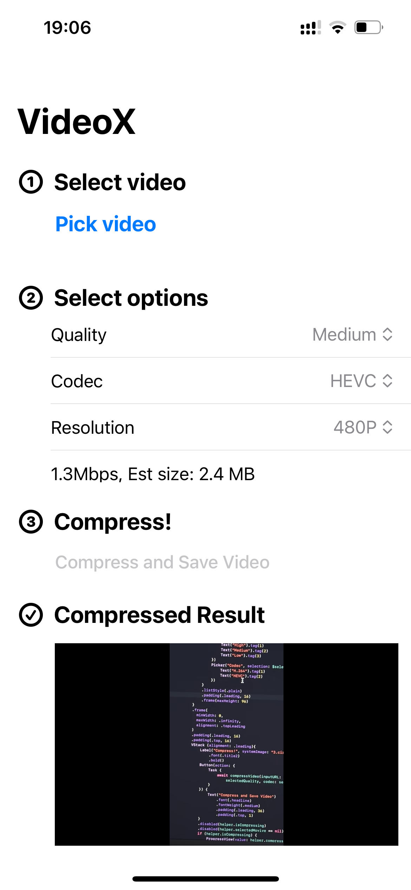

# VideoX

VideoX is an open source video compress app for iOS with clean UI.

## 👀 Preview

## 🌟 Features and Informations

- Support iOS 17+
- Choose codec from HEVC/H.264
- 5 levels of compression rate
- Support Resolution:
  - Original
  - 4K (2160p)
  - 2K (1440p) 
  - 1080P
  - 720P
  - 480P
  - 360P
- A simple and elegant UI powered by pure SwiftUI
- Lightweight: Less than 1MB in size, hardware accelerated encoding powered by [AVFoundation](https://developer.apple.com/documentation/avfoundation)

## 🥰 Thanks

Thanks to GPT-4o, I was able to complete this small project in 6 hours, even though I only have a little Swift/iOS experience.

> GPL 3.0, pure SwiftUI, ~100kB bundle size with no dependencies, you deserve better.

Made with ❤️ by [alikia2x](https://alikia2x.com).
